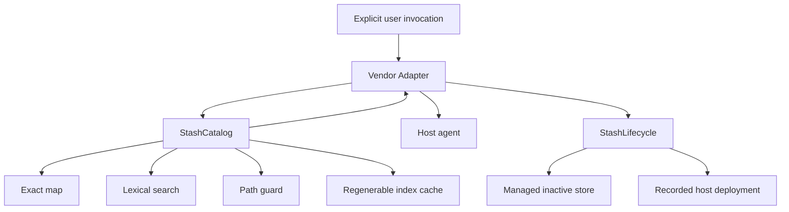

# Architecture

## Contents

- [System shape](#system-shape)
- [Module Interfaces](#module-interfaces)
- [Internal implementation](#internal-implementation)
- [Adapter seam](#adapter-seam)
- [Data flow](#data-flow)
- [Cache behavior](#cache-behavior)
- [Lifecycle data flow](#lifecycle-data-flow)
- [Rejected extensions](#rejected-extensions)

## System shape



The product has two deep Modules with different authority. `StashCatalog` is
read-only across every configured catalog. `StashLifecycle` alone may write to
the Stash-managed root or an explicitly selected standalone deployment target.
It never mutates an external catalog, plugin, or vendor setting.

The model keeps three independent dimensions: `catalogId` identifies local storage, `group` supplies functional taxonomy, and `source` records provenance. A source filter accepts an exact ID, display name, or URL. Resolve filters compose across those dimensions before exact lookup, listing, or discovery.

## Module Interfaces

```ts
interface StashCatalog {
  resolve(request: ResolveRequest): Promise<ResolveResult>;
  read(request: ReadRequest): Promise<ReadResult>;
  refresh(request?: RefreshRequest): Promise<RefreshResult>;
  doctor(request?: DoctorRequest): Promise<DoctorResult>;
}
```

The Interface is the test surface. Search libraries, tokenization, index shape, and filesystem details are implementation details.

```ts
interface StashLifecycle {
  install(request: LifecycleInstallRequest): Promise<LifecycleMutationResult>;
  archive(request: LifecycleArchiveRequest): Promise<LifecycleMutationResult>;
  activate(request: LifecycleActivateRequest): Promise<LifecycleMutationResult>;
  deactivate(request: LifecycleDeactivateRequest): Promise<LifecycleMutationResult>;
  status(request?: LifecycleStatusRequest): Promise<LifecycleStatusResult>;
}
```

Lifecycle state is not one enum. Store presence, tree integrity, deployment
presence, Stash ownership, and host observation are orthogonal fields. A
deployment can still be disabled by a host override, so that observation stays
`unknown`. A path not created and recorded by Stash cannot be removed by
`deactivate`.

## Internal implementation

```text
src/
├── stash-catalog.ts
├── stash-lifecycle.ts
├── types.ts
└── internal/
    ├── configuration.ts
    ├── catalog-index.ts
    ├── search.ts
    └── util.ts
```

Responsibilities:

- `configuration.ts`: resolve platform configuration and validate catalogs.
- `catalog-index.ts`: canonicalize roots, discover skills, parse metadata, generate records, atomically cache indexes.
- `search.ts`: normalize text, score lexical evidence, classify relevance, and render compact records.
- `util.ts`: hashing, cursor integrity, path containment, tokenization, platform locations.
- `stash-catalog.ts`: orchestrate the Interface and normalize errors/results.
- `stash-lifecycle.ts`: validate portable skill trees, serialize mutations,
  stage atomic copies, maintain archive recovery journals, record stable skill
  and deployment identities, detect drift, and enforce standalone-only
  destructive boundaries.

## Adapter seam

The vendor seam is real because there are multiple implementations:

- Codex uses standard frontmatter plus `agents/openai.yaml`.
- Claude Code adds `disable-model-invocation: true`.
- Antigravity uses different plugin manifests and has no documented manual-only field.

Search and security behavior never live in an Adapter. Generated Adapters contain the same bundled CLI.

## Data flow

Exact:

```text
explicit name → normalized exact map → ref → safe read
```

Discovery:

```text
query → normalization → lexical score → evidence tier
      → relevant set → deterministic order → cursor page
      → selected ref → safe read
```

Resource read:

```text
ref + relative resource
  → index lookup
  → canonical skill root
  → traversal/realpath containment
  → optional expected hash
  → content or verified local path
```

## Cache behavior

The index is not a source of truth.

- Missing cache: scan and build.
- Cache younger than `cacheTtlMs`: use directly.
- Zero or negative `cacheTtlMs`: compare the fingerprint on every load.
- Older cache: compare a path/mtime/size fingerprint.
- Changed fingerprint: rebuild and atomically replace.
- Changed index schema: ignore the older cache file and build the current version.
- Explicit `stash index`: rebuild.
- `stash doctor`: scan without repairing or mutating the catalog.

External catalog files are never written. The managed root is a separate
source of truth owned by `StashLifecycle`.

## Lifecycle data flow

Install preserves the source:

```text
explicit local skill → reject links/special files/path collisions
  → parse SKILL.md → snapshot tree hash
  → hidden same-root staging → copy + re-hash
  → atomic rename → provenance record → stored
```

Archive adds a destructive second phase only for an explicitly selected
standalone directory:

```text
journal start → verified managed commit → journal update
  → atomic rename outside host discovery → journal update
  → re-hash tombstone → archive commit → delete tombstone + journal
```

On the next mutation, an incomplete journal either restores the original source
without overwriting an occupied path or finishes committed cleanup. Lock
ownership is atomically published as a complete directory record. A proven-dead
PID is reclaimed under a separate atomic guard; malformed or live ownership
fails closed and is never removed based on age alone.

Every managed skill has a stable `skillId`; every deployment links to it with a
separate `deploymentId`, target ID, Stash ownership marker, and expected tree
hash. Activation is a tracked copy deployment. Deactivation requires all of
those ownership facts plus the matching tree hash; untracked or drifted content
is preserved.

Search applies a read-only managed projection. If a configured catalog record's
exact directory and current tree hash match an imported source or Stash-owned
deployment, that record is folded into the managed canonical result's
`relatedCopies`. Drifted or unrelated records remain separate with a warning.
Catalog-scoped lookup bypasses the projection, and raw refs remain readable, so
projection never changes or hides the underlying read-only library.

## Rejected extensions

The first release intentionally excludes:

- vector and embedding search;
- a second LLM router;
- a background daemon;
- transcript telemetry;
- remote Git installation and updates;
- symlink deployment and overwrite;
- plugin lifecycle and vendor setting mutation;
- workspace lifecycle targets and flat-file Antigravity CLI skills;
- script execution;
- a web UI.

Add one only after a measured failure demonstrates that the current Interface cannot meet a real workload.
