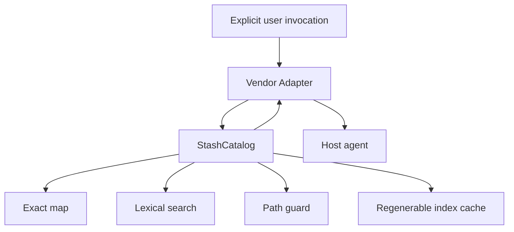

# Architecture

## Contents

- [System shape](#system-shape)
- [StashCatalog Interface](#stashcatalog-interface)
- [Internal implementation](#internal-implementation)
- [Adapter seam](#adapter-seam)
- [Data flow](#data-flow)
- [Cache behavior](#cache-behavior)
- [Rejected extensions](#rejected-extensions)

## System shape



The core is one deep Module. Callers learn four operations while the implementation hides catalog traversal, YAML parsing, indexing, relevance, pagination, cache invalidation, hash checks, and safe resource resolution.

## StashCatalog Interface

```ts
interface StashCatalog {
  resolve(request: ResolveRequest): Promise<ResolveResult>;
  read(request: ReadRequest): Promise<ReadResult>;
  refresh(request?: RefreshRequest): Promise<RefreshResult>;
  doctor(request?: DoctorRequest): Promise<DoctorResult>;
}
```

The Interface is the test surface. Search libraries, tokenization, index shape, and filesystem details are implementation details.

## Internal implementation

```text
src/
├── stash-catalog.ts
├── types.ts
└── internal/
    ├── configuration.ts
    ├── catalog-index.ts
    ├── search.ts
    └── util.ts
```

Responsibilities:

- `configuration.ts`: resolve platform configuration and validate catalogs.
- `catalog-index.ts`: canonicalize roots, discover skills, parse metadata, generate records, atomically cache indexes.
- `search.ts`: normalize text, score lexical evidence, classify relevance, and render compact records.
- `util.ts`: hashing, cursor integrity, path containment, tokenization, platform locations.
- `stash-catalog.ts`: orchestrate the Interface and normalize errors/results.

## Adapter seam

The vendor seam is real because there are multiple implementations:

- Codex uses standard frontmatter plus `agents/openai.yaml`.
- Claude Code adds `disable-model-invocation: true`.
- Antigravity uses different plugin manifests and has no documented manual-only field.

Search and security behavior never live in an Adapter. Generated Adapters contain the same bundled CLI.

## Data flow

Exact:

```text
explicit name → normalized exact map → ref → safe read
```

Discovery:

```text
query → normalization → lexical score → evidence tier
      → relevant set → deterministic order → cursor page
      → selected ref → safe read
```

Resource read:

```text
ref + relative resource
  → index lookup
  → canonical skill root
  → traversal/realpath containment
  → optional expected hash
  → content or verified local path
```

## Cache behavior

The index is not a source of truth.

- Missing cache: scan and build.
- Cache younger than `cacheTtlMs`: use directly.
- Older cache: compare a path/mtime/size fingerprint.
- Changed fingerprint: rebuild and atomically replace.
- Explicit `stash index`: rebuild.
- `stash doctor`: scan without repairing or mutating the catalog.

Catalog files are never written.

## Rejected extensions

The first release intentionally excludes:

- vector and embedding search;
- a second LLM router;
- a background daemon;
- transcript telemetry;
- skill installation and updates;
- vendor setting mutation;
- script execution;
- a web UI.

Add one only after a measured failure demonstrates that the current Interface cannot meet a real workload.
